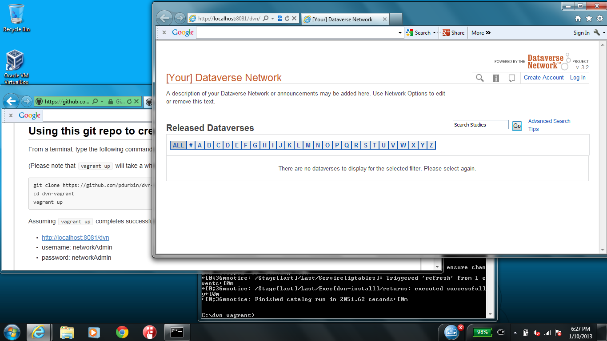
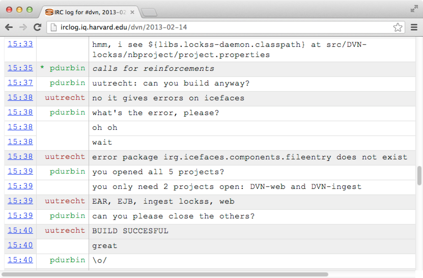
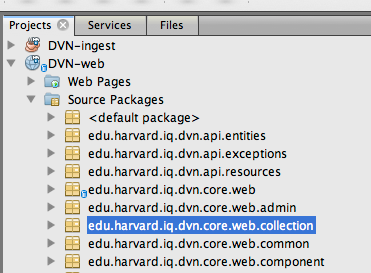
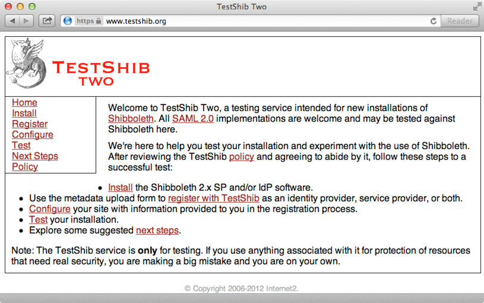
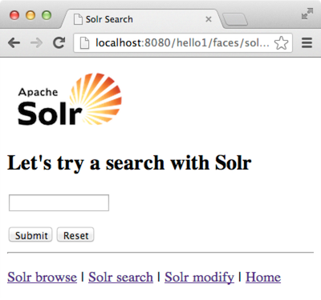

## What is Vagrant?

"Development environments made easy. Create and configure lightweight, reproducible, and portable development environments." -- http://vagrantup.com

"Using virtual machines running locally on your workstation, Vagrant lets you define the environment your application will run in and quickly iterate on both your application and its environment." -- http://wiki.greptilian.com/vagrant

---

## Example: DVN install demo

https://github.com/dvn/dvn-install-demo

From https://groups.google.com/d/msg/dataverse-community/wRxRSGE8VpQ/zgU6AOHVRZwJ

"If you want to try an experimental, as yet unsupported, DVN on VM configuration, try this: https://github.com/pdurbin/dvn-vagrant . It uses Virtual Box and CentOS 6 and a Vagrant script..." -- https://groups.google.com/d/msg/dataverse-community/-dE_1rt6nlg/Qoy6bsIlKn0J

---

## Example: Puppet configs for http://irclog.iq.harvard.edu

https://github.com/dvn/iqirclog-vagrant

---

## Example: DVN dev environment

https://github.com/dvn/dvn-netbeans

---

## Example: Shibboleth proof of concept

https://github.com/dvn/shibpoc

---

## Example: IQSS Java EE template

https://github.com/IQSS/iqss-javaee-template

---

## Non-IQSS Examples

- https://github.com/discourse/discourse/blob/master/docs/VAGRANT.md
    - http://meta.discourse.org/t/how-do-you-automate-trust/1785/6
- https://github.com/berekuk/play-perl
- https://github.com/cwebberOps/rt-vagrant
- https://github.com/boegel/easybuild-vagrant
- https://github.com/stackforge/puppet-openstack_dev_env
    - Many VMs at https://github.com/stackforge/puppet-openstack_dev_env/blob/master/Vagrantfile
- https://github.com/pdurbin/foodeys-vagrant
    - https://github.com/pdurbin/foodeys-vagrant/issues/1#issuecomment-16152767
- https://github.com/pdurbin/greptilian-vagrant
- ... 9506 results at https://github.com/search?q=Vagrantfile&type=Code

---

## Concepts

- base boxes: http://www.vagrantbox.es
    - vagrant user who can sudo to root
    - make your own base boxes with https://github.com/jedi4ever/veewee
- provisioning with Puppet, Chef, Ansible, etc.: http://docs.vagrantup.com/v2/provisioning
- shared/synced folders
- `vagrant destroy`

---

## Fork this talk on GitHub

The source for this talk: https://github.com/IQSS/vagrant-at-iqss
